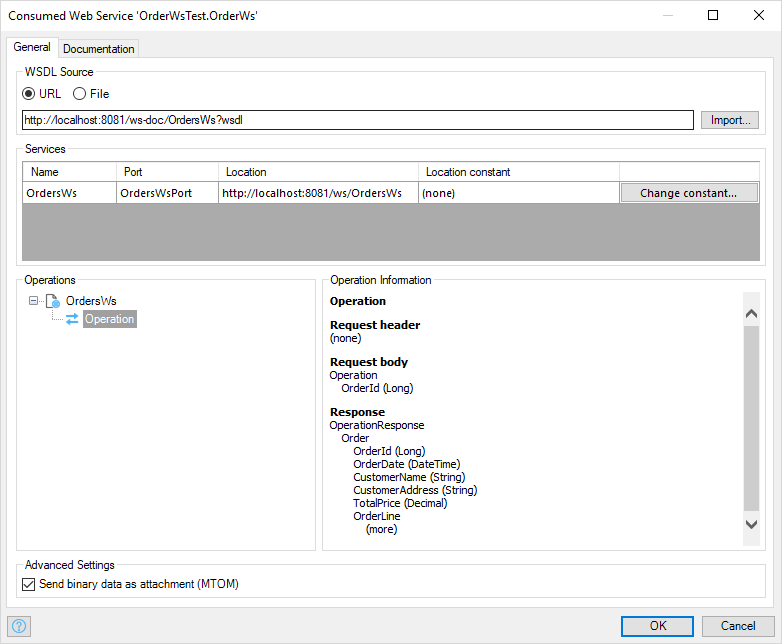
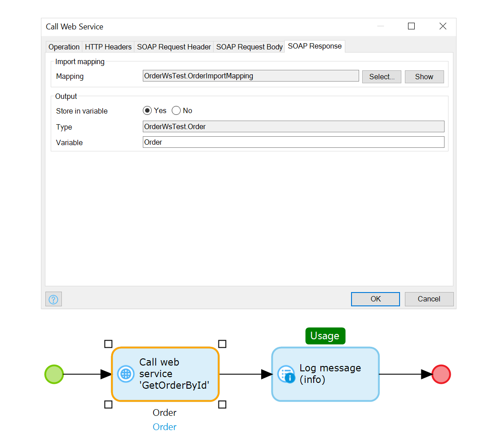
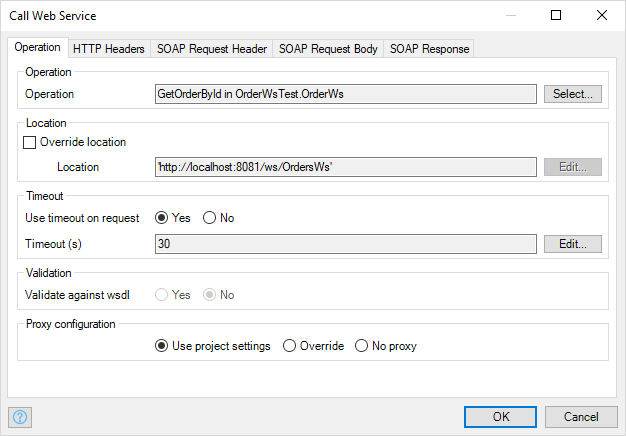

## 1 How Can I Consume a REST API? {#consume-rest-api}

Calling a REST service is simple. First, you define what the external resources you are going to use look like by creating a message definition. The easiest way to do this is usually to create a JSON structure by copying and pasting an example JSON message. Mendix will automatically determine the structure of your message and the applicable attribute types, as illustrated below.

<video controls src="attachments/Integration_Add_JSON_Structure.mp4">VIDEO</video>

Next, you need to define mappings to import and export data to the external REST service. This is similar to the example above. It is important to note here that you can generate domain model entities if you do not already have the appropriate entities. This is probably the case when you have defined a message based on an example JSON.

Finally, you use the **Call REST** activity in your microflows to call the REST API. This is simply a case of providing the URL of the API.  In the **Request** and **Response** tabs, you can define which mappings you want to use.

<video controls src="attachments/Integration_CallRest.mp4">VIDEO</video>

## 2 How Can I Consume a SOAP Service?

When you have a WSDL (either from a Mendix application or from a third-party application), you can import it into your Mendix app. All you have to do is create a new consumed web service document and specify the location of your WSDL.

{}

{}

You can call any operation in the consumed web service via the **Call Web Service** activity in a microflow. When calling an external web service, you can use import and export mappings to ensure your domain models are easily converted to and from any messages you need to exchange with the service.

{}

{}

The Mendix Platform offers you all the control and flexibility you need when dealing with web services:

* **Proxies** – You can define proxy settings per app, but also override proxy settings per service call. This can be useful when internal web services need different proxy settings from external services.
* **Timeouts** – To deal with unresponsive services, you can specify timeout settings. In the error handler of the service call, you can define what to do in case of an unresponsive service.
* **Authentication** – Mendix supports different ways of providing credentials to external services, from basic HTTP authentication to completely custom SOAP header settings.
* **Certificates (security)** – You can provide client certificates for authentication with services. For details, see [How to Use a Client Certificate](https://docs.mendix.com/howto/integration/use-a-client-certificate) in the Mendix documentation.
* **Binary attachments** – Mendix provides out-of-the-box support for efficiently sending binary data using the Message Transmission Optimization Mechanism (MTOM).

{}

{}

