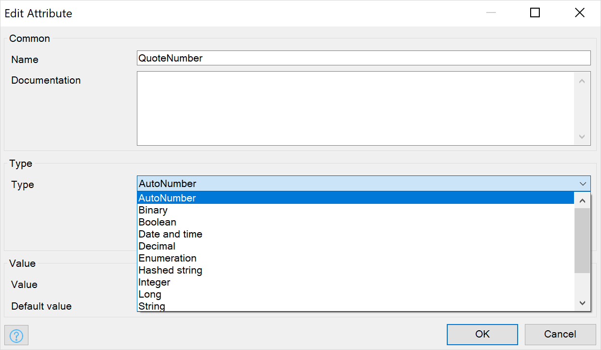
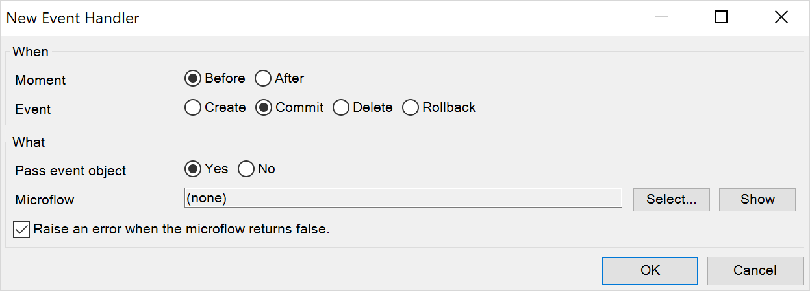
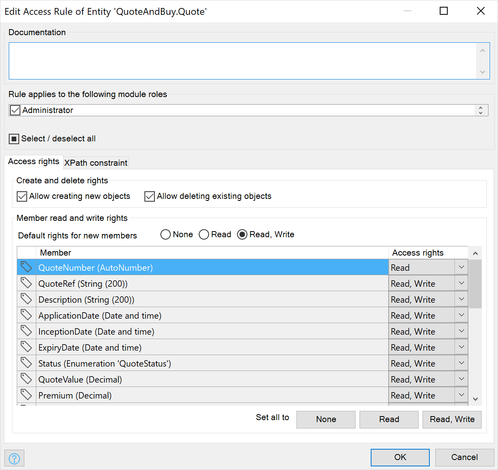
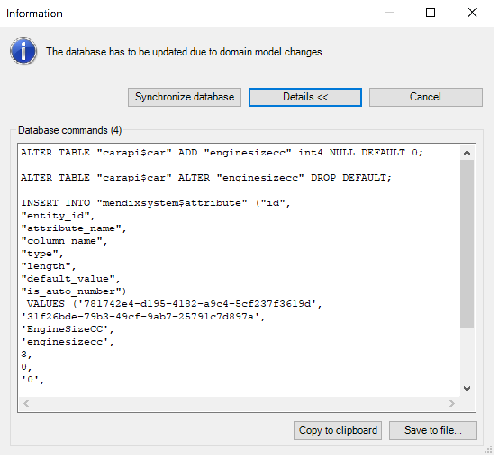
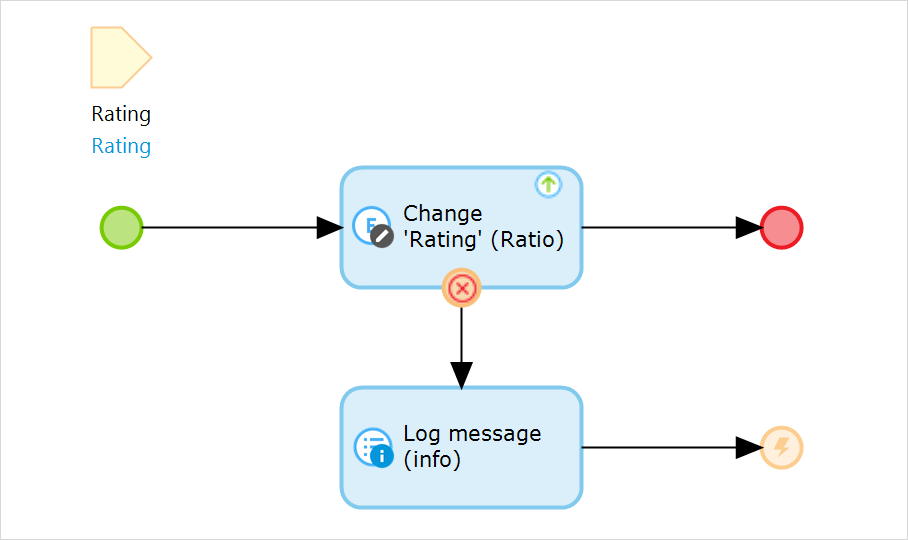

## 1 How Do I Define Data in Mendix?

In Mendix, you define your data needs using domain models. Every module can have its own domain model. A domain model consists of one or more entities, and these entities can be persistable or non-persistable. Entities contain one or more objects.

{}

{}

Persistable  objects are stored in a database, and Mendix automatically creates tables to store your entities in the database. For every object, one record is inserted in the table. Non-persistable entities only live in memory for the duration of a user session.

For every entity, you can define the attributes and what type of data the attributes should hold. You can also define security rules, who can see what data, and validation rules. A validation rule specifies what values are allowed for an attribute.

When you start or redeploy your application, Mendix automatically creates database tables to store your data. When you redeploy, all of your app's tables are automatically changed as required, and data is migrated to the new table structures.

## 2 What Is the Difference Between Persistable and Non-Persistable Objects?

Persistable  objects are stored in a database, so you can use your data across sessions and across users. However, because non-persistable  entities only live in memory for the duration of a user session, such entities cannot be shared between users or across user sessions.

Non-persistable  entities are mostly used for calculations where you do not want to store all the intermediate results, or for temporarily storing data fetched from external systems through different integration means.

<video controls src="attachments/Integration_PersistableEntity.mp4">VIDEO</video>

## 3 How Do I Ensure the Integrity of My Data?

Mendix supports different methods to ensure the integrity of your application data:
* Data types – ensure that only valid data types can be stored
* Validation rules – validate if the data is unique, specified, and within a range
* Event handlers – use microflows to provide custom logic to validate data
* Access rules – ensure only authorized users can access or modify data
* Referential integrity – ensure data is stored with the required associated data

### 3.1 Data Types

Data types define what sort of data can be stored in an attribute. The type ensures that, for example, text fields only contain text and numeric fields only contain numbers.

You can use the following types for your attributes:
* Autonumber – an automatically generated number
* Binary – binary data
* Boolean – true or false
* Date and time – a point in time
* Decimal – a positive or negative number
* Enumeration – one value of a predefined set of values
* Hashed string – the hash value of a string
* Integer – a 32-bit whole number
* Long – a 64-bit whole number
* String – text containing letter, numbers, spaces, and other characters

{}

{}

For more details, see the section [Type](https://docs.mendix.com/refguide/attributes#type-1) in *Attributes* in the Mendix Reference Guide.

### 3.2 Validation Rules

Validation rules specify the rules to which your data should adhere. If your data does not follow the rules specified, you will receive an error when you try to save the data.

{}

{}

Depending on the rule type, this will be handled by the Mendix Runtime or by the database.

### 3.3 Event Handlers

Event handlers give you the ability to run logic before or after certain events. There are many use cases for this, such as the following:
* Setting default values on object creation – if you want to initialize a new object (for example, one with non-constant default values), you can use a before-create event
* Keeping an audit trail – sometimes keeping a trail of all the changes made to data is required, and after-events enable you to do this by storing any changes into an audit trail object (the [Audittrail](https://appstore.home.mendix.com/link/app/138/) module in the Mendix App Store provides this exact functionality)
* Validating data changes – before-events can be used to trigger a microflow that validates data changes

To set event handlers on all the entities in your application, you can use the Mendix Java API. For example, to set a before commit event listener for all entities, use this method: [Core.getListenersRegistry().registerAfterCommitListener](https://apidocs.mendix.com/7/runtime/index.html?com/mendix/core/actionmanagement/ListenersRegistry.html).

{}

{}

### 3.4 Access Rules

A major aspect of data integrity relates to who is allowed to change what data. Data authorization is a built-in feature of the Mendix Platform. User roles can be directly tied to what those roles are allowed to do with the end-user's data.

Access right aspects that you can define on entities include the following:
* Who can read or change entities
* Who can read or change attributes
* Who can create or delete entities

You can also use XPath constraints to define so-called row-level security, which defines what objects a user is allowed to see. This can be used to ensure customers can only see their data, case workers can only see data related to their cases, or tenants get access to only their tenant data in a multi-tenant application.

{}

{}

### 3.5 Referential Integrity

Referential integrity is added inside the Modeler using delete behavior properties. Delete behavior defines what should happen to the associated object when an object is deleted. The following options can be configured for each end of the association.

| Value |	Description |
| --- | --- |
| Delete {name of entity} object but keep {name of other entity} object(s) | When an object is deleted, the associated object(s) is not deleted. |
| Delete {name of entity} object and {name of other entity} object(s) as well | When an object is deleted, the associated object(s) is also deleted. |
| Delete {name of entity} object only if it has no {name of other entity} object(s)	| An object can only be deleted if it is not associated with any other object(s). |

Here are two examples:

* Delete {name of entity} object but keep {name of other entity} object(s) (default value):

  

  * This delete behavior is used if you want to delete any associated **Customer_Profile** when a **Customer** is deleted

* Delete {name of entity} object only if it has no {name of other entity} object(s):

  

  * This delete behavior is used if you want to be able to delete a **Customer** only if it is not associated with any **Order**

## 4 How Does Object-Relational Mapping Work in Mendix? {#object-relational-mapping}

Mendix object-relational mapping (ORM) handles all aspects of your database management, from your modeled data needs to technical storage and retrieval with most popular relational database systems. The main goal of Mendix ORM is to remove the need for users to think about technical database aspects, like how to create and modify tables or access and update data.

### 4.1 Data Definition Language

Mendix ORM starts with a data definition language (DDL) phase upon deployment of your application, which will automatically create the correct database structures based on your business data requirements as you model them in your domain models.

The database structure created will include tables, data types, associations, relevant constraints and even inheritance.

It is important to note that whenever you make changes to your applications, the underlying database tables will be automatically updated accordingly. Your data will also be migrated.

{}

{}

By handling both table creation and data migration, the Mendix Platform helps you to deliver apps quickly. You do not have to manage the database schema yourself. Equally important is that for most migrations (for example, attribute renaming or type changes), Mendix also automates data migration.

In a private cloud environment or when you are deploying on premises, you do have the option to manage the database yourself. In this case, you can take the SQL generated by Mendix as a starting point, and then give it to your database administrator so they can ensure the database is created as required.

The data migration phase can also migrate data from one Mendix app to another across different database vendors. This can be useful if you want to migrate from on-premises to cloud or from one cloud to another cloud. For more details, see [How to Migrate Your Mendix Database](https://docs.mendix.com/howto/tips/migrating-your-mendix-database) in the Mendix documentation.

### 4.2 Data Retrieval

Mendix offers a number of ways to specify what data you want to retrieve:
* Both the Desktop Modeler and Web Modeler offer visual ways to specify your query needs
* To retrieve specific objects or a set of related objects, you can use XPath expressions
* For reporting needs (where aggregation and the joining of multiple entities into a single result set is important), Mendix offers OQL queries

Under the hood, all retrieves are first translated into XPath, then into OQL, and finally into database-specific SQL statements.

When retrieving data, Mendix ORM performs the following steps for you:

1. Translates your XPath query into an OQL query.
2. Includes additional retrieve requirements (for example, on associated objects that are also needed by your pages).
3. Applies security rules as defined on your entities.
4. Maps your entities to technical database tables.
5. Maps your entity attributes to table columns.
6. Optimizes the required OQL statements.
7. Translates the OQL statement to database-specific SQL statements.
8. Retrieves the records from the database.

As you can see, Mendix ORM applies a number of performance optimizations that are far from trivial. Because of the application model, the Mendix Platform can determine that it is more efficient to query associated database records in one go.

## 5 How Can I Use Indexes to Improve Performance?

Indexes are lists of attributes for which a database index is created on the underlying database table of the entity. Indexes improve the speed of retrieving objects if the indexed attributes are used in a search field, in the XPath constraint of a data or template grid, or in an XPath query.

Indexes are added using the entity properties menu inside the Modeler. Multiple indexes can be added to one entity.

<video controls  src="attachments/IndexSettings.mp4">Using indexes to improve query performance</video>

## 6 How Can I Use a Stored Procedure with Mendix?

Using a stored procedure in Mendix depends on where your data resides.

If you want to use a stored procedure in the database of your Mendix application, you can use the Mendix Java API. For details, see [How to Use the Java API](https://docs.mendix.com/howto/logic-business-rules/java-api-tutorial). And for details on executing SQL statements on your Mendix application database using JDBC, see [DataStorage executeWithConnection](https://apidocs.mendix.com/7/runtime/com/mendix/datastorage/DataStorage.html#executeWithConnection-java.util.function.Function-)

If you are using an external database, you can use the [Database Connector](https://appstore.home.mendix.com/link/app/2888/) add-on available in the Mendix App Store.

Calling stored procedures is mostly relevant if you are building on top of an existing legacy database. In this area, there are a lot of Oracle relational database management systems (RDBMSs). The [Oracle Connector (Beta)](https://appstore.home.mendix.com/link/app/8683/) available in the Mendix App Store provides support for features often seen in legacy Oracle databases, such as table APIs built with PL/SQL stored procedures and packages, ref cursors, and user-defined types.

## 7 How Does Mendix Handle Transaction Management?

Every request to the Mendix Runtime is automatically starts a new transaction. Upon successful completion of the request, the transaction is committed with all related data. In case of an error, all the data changes are rolled back by default. You have the option to provide custom error handling logic to change this default behavior.

In the following microflow, a custom error handler is defined. When the **Change** activity fails, any changes it made to the database are rolled back. The error handler defines what you want to do with the transaction: you can roll back everything that happened in the microflow, or you can compensate for the problem and continue. In this example a log message is generated, after which the microflow ends in an error. The calling microflow can then decide how to handle this.

 

## 8 What Databases Does Mendix Support? {#database-support}

A Mendix application can by default be deployed to a number of different database servers. As long as you do not include any database-specific code, you can switch database vendors at any moment.

The Mendix Platform supports the following database servers:

 * PostgreSQL 9.2, 9.3, 9.4, 9.5, 9.6
 * Microsoft SQL Server 2008, 2008 R2, 2012, 2014, 2016
 * Microsoft Azure SQL Database
 * Oracle Database 11g Release 2, 12c Release 1
 * IBM DB2 11.1
 * MariaDB 5.5, 10.0, 10.1
 * MySQL 5.5, 5.6, 5.7
