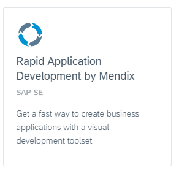
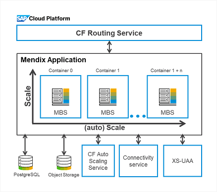
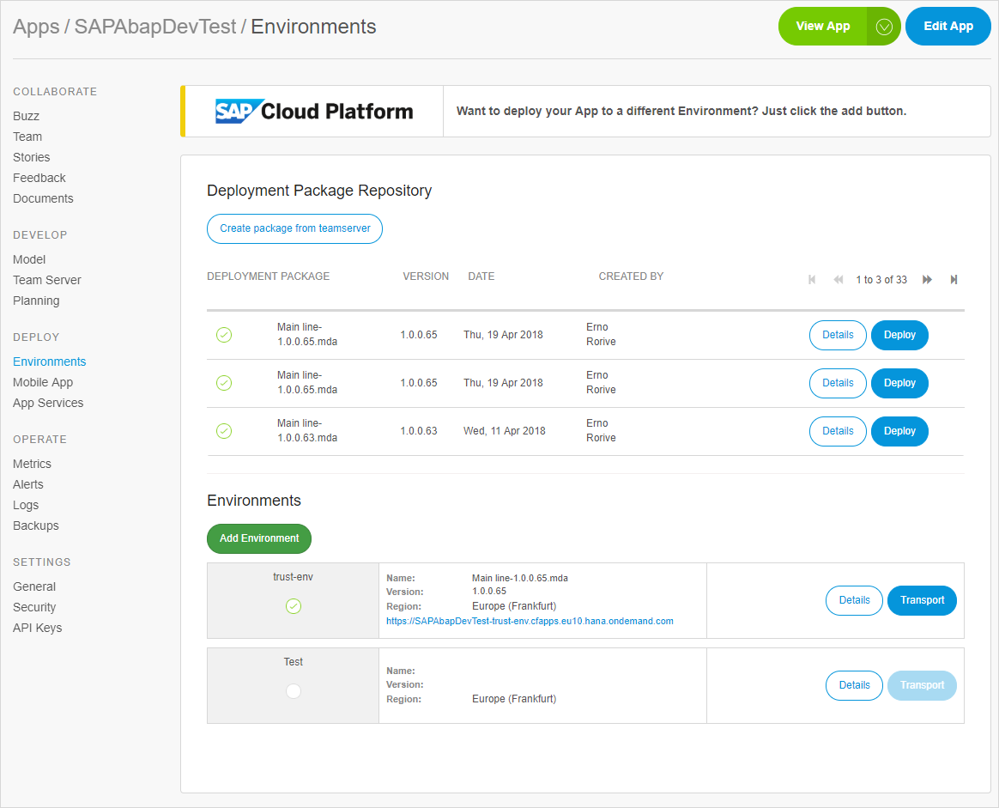
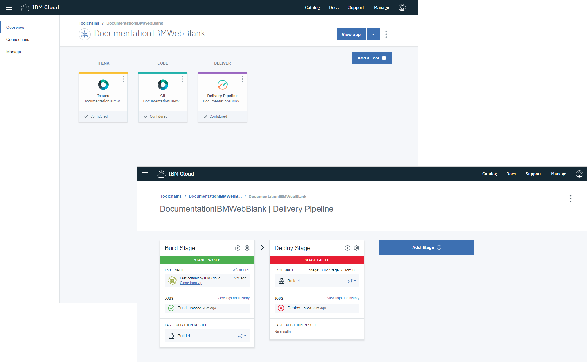
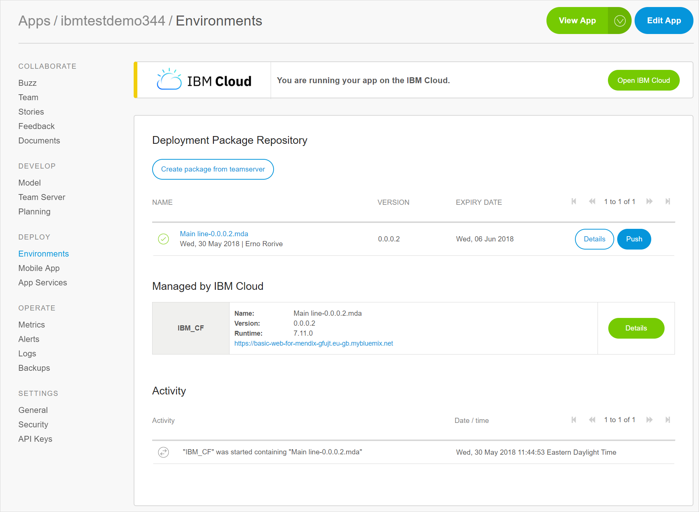

## 1 Running on the SAP Cloud Platform {#running-sap-cloud}

Mendix has a partnership with SAP of the **Solution Extension** type. This means that SAP has fully adopted the Mendix Platform as their rapid application development platform to extend the SAP Business Suite, SAP S/4 Hana, SuccessFactors, and other SAP solutions.

As part of this partnership, the Mendix Development Portal is fully integrated with the SAP Cloud Platform to deliver a one-click deployment functionality similar to the Mendix Cloud.

For more information, see [SAP Cloud Platform Rapid App Development by Mendix](https://cloudplatform.sap.com/dmp/capabilities/us/product/SAP-Cloud-Platform-Rapid-Application-Development-by-Mendix/b9ec34b2-9343-46a9-9ed4-030997a40eb1).

### 1.1 How Does Mendix Run on SAP Cloud Platform?

The SAP Cloud Platform is available in two development environments: SAP Neo and SAP Cloud Foundry (which is their newest option). Mendix is integrated with the SAP Cloud Foundry environment.

A Mendix application is deployed by the Mendix Development Portal using the Mendix Cloud Foundry buildpack. The application is supported by a PostgreSQL service, an optional storage service for files, an authentication and authorization service, and a connectivity service.

Based on the cloud-native architecture of the Mendix application as well as the Cloud Foundry capabilities, a Mendix application running on the SAP Cloud Platform is fully highly available, and it supports vertical, horizontal, and auto scaling.

### 1.2 How Is the Mendix Development Portal Integrated with the SAP Cloud Platform?

The deployment of a Mendix application to the SAP Cloud Platform is fully integrated in the application lifecycle of Mendix.

As soon as you are ready to run your application, you can visit the Mendix Developer Portal to transport the app to the SAP Cloud Platform. The Developer Portal will perform all the actions required to set up your application and run it on the SAP Cloud Platform.

You can use the Mendix Development Portal to control the application items below within the SAP Cloud Platform:

* Sizing
* Application constants
* Scheduled events
* Deployments
* Status

This video presents how you can create an environment;

<video controls src="attachments/CreateAnEnvironment.mp4">VIDEO</video>

### 1.3 How Can I Run in High Availability Mode on the SAP Cloud Platform?

You can run a Mendix application in high availability on the SAP Cloud Platform via the scaling option. By creating more than one instance of your application, your application will automatically start running in high availability.

### 1.4 Does Mendix Have Auto-Scaling Support on the SAP Cloud Platform?

The SAP Cloud Platform has a service that provides auto-scaling capabilities. It has two methods to auto-scale an application:

* The service can increase or decrease the amount of running container instances of the application based on application dynamics like memory, throughput, or response time, or
* The service can auto-scale based on a schedule

A Mendix application has full support to work with this service in order to optimize resource utilization and performance reliability.

### 1.5 How Can I Use the SAP Cloud Platform's Authentication and Authorization Service to Enable SSO for My Mendix Application?

Within the SAP Cloud Platform, it is possible to connect your own identity provider (IDP) for managing the user authentication and authorization of your applications running on the SAP Cloud Platform. A Mendix application supports this service out of the box. During deployment of the Mendix app, the authentication and authorization service (SAP XSUAA Connector) is automatically bound to the app. The Mendix app will use this service to provide an SSO experience with your IDP.

For more details, see [How to Use the SAP XSUAA Connector](https://docs.mendix.com/howto/sap/use-sap-xsuaa-connector) in the Mendix documentation.

### 1.6 How Do I Connect My Mendix Application with My On-Premises SAP System When Running on the SAP Cloud Platform?

To extend your on-premises SAP system, a secure connection is required between the SAP Cloud Platform and your premises. This is done via the SAP Cloud Connector, which is installed on your premises in order to create a secure tunnel between your premises and the SAP Cloud Platform.

When deploying a Mendix application on the SAP Cloud Platform, the SAP Connectivity service is automatically bound to your app. This service provides the necessary information to the Mendix appfor it to use the tunnel and connect to your on-premises system.

### 1.7 How Can I Set Up Principle Propagation Between My Mendix Application and the SAP Back-End?

The SAP Cloud Connector must be configured for principle propagation with the back-end system, which is a standard operation within the SAP Cloud Connector. For the developer of the Mendix app, no effort is required.

For details on this integration, see the section [How Does Mendix Support Principle Propagation Between My Mendix Application and the SAP Back-End System?](../strategic-partners/sap-integration#principle) in the *SAP* chapter.

## 2 How Can I Run Mendix on IBM Cloud? {#ibm-cloud}

IBM has selected Mendix has their standard low-code development platform on top of IBM Cloud. In this partnership, IBM has created a seamless integration with the Mendix development lifecycle, so it is possible to run your Mendix application with one click on IBM Cloud and consume the rich set of IBM services.

Within the standard application development experience of IBM, Mendix has been adopted with a few starter kits. These starter kits allow you to start a new web, mobile, or Watson-oriented application on IBM Cloud. When creating an app, a full toolchain is automatically created with a delivery pipeline to run your application on IBM Cloud Foundry or Kubernetes.

This pipeline is integrated with the Mendix package repository. As soon as a new release package is created within the Mendix Platform, the pipeline is notified and the user can deploy the app with single click.

### 2.1 How Can I Select the Way to Run Mendix on IBM Cloud?

When selecting an IBM starter kit (via either the IBM Cloud Portal or the Mendix Platform Portal), the choice for deployment type is presented during the app creation flow:

Both deployment options provide full high availability as well as horizontal and vertical scaling.
