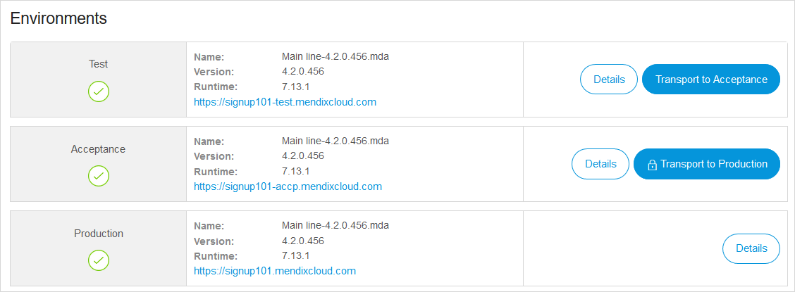
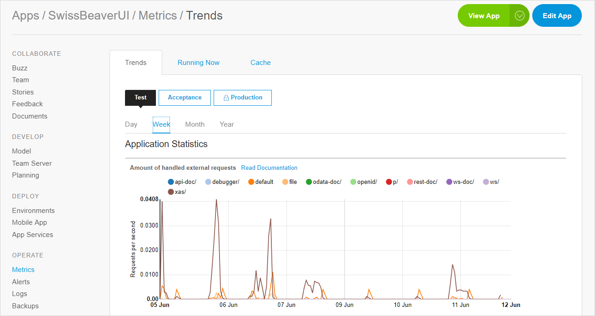
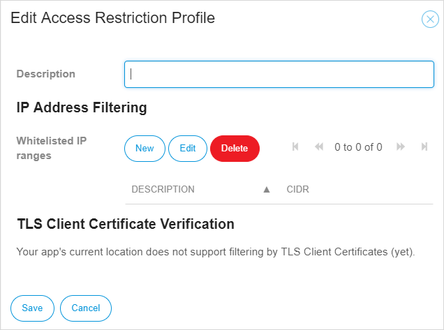

## 1 How Can I Run Mendix on the Mendix Cloud {#mendix-cloud}

The Mendix Cloud is the deployment solution in which Mendix provides hosting environments for customers. The Mendix Cloud is built on top of Cloud Foundry and AWS, is available in multiple regions around the globe, and comes with high availability options. For more information on the Mendix Cloud architecture, see [Architecture Principles](../enterprise-capabilities/architecture-principles).

The Mendix Cloud should be selected for its low maintenance costs, the services included (like backups, metrics, logs, and alerts), and the amount of insight available for Mendix Support.

## 2 What Does the Mendix Cloud Architecture Look Like?

The Mendix Cloud is a PaaS-based cloud architecture using Cloud Foundry running on top of AWS. A Mendix application runs within fully isolated containers, consuming PaaS service like database and storage.

For each region, the cloud architecture is set up fully high available and divided in multi-availability zones. This means there is a fully reliable offering for disaster recovery.

For more information on Mendix architecture, see [Architecture Principles](../enterprise-capabilities/architecture-principles).

## 3 What Mendix Cloud Regions Are Available?

Mendix Cloud is currently available in the following regions:

* US East
* EU Central
* EU West
* UK
* Japan

New applications can be placed in any of the available regions. Mendix adds new regions based on customer demand.

{}[**Erno, what is the significance of the numbers and colors in the diagram below? This won't be clear to the reader.**]{}

## 4 Which Features Are Available in the Mendix Cloud? {#cloud-portal}

The Mendix Cloud has a full range of features that make it efficient to manage your application deployments and monitor your application and database performance. The Mendix Cloud enables you to configure custom domains, backups, alerts, and logs. You can use the fine-grained access controls that are provided, and in the long-term, you make use of the rich set of tools for live debugging.

The Mendix Cloud is the most optimized and self-service cloud for running Mendix applications. It comes with a rich set of features to ensure that your your applications are run with the best possible business continuity and self-control.

Features delivered by the Mendix Cloud are described in the sections below.

### 4.1 Application Deployment Management

This feature allows you to deploy a Mendix application with a single click from both the Mendix Development Portal and the Modeler.

### 4.2 Custom Domains

When you receive a new Mendix Cloud environment for you application, it is standard that a domain name is assigned based on the name of your app. Next to this domain, it is possible for you to add you own custom domain as well.

### 4.3 Backups

Each application running in the Mendix Cloud gets a default daily backup. Next to that, it is possible to create a backup of your application at any time via self-service. Optionally, it is possible to upgrade your backup policy to go to real-time replication and backup.

For more details, see the section [How Does Mendix Cloud Support Backup and Recovery?](#support-backup) below.

### 4.4 Application and Database (Performance) Monitoring

The Mendix Cloud Portal provides all the necessary metrics for you to analyze the performance of your application. This is not limited to insights into memory or CPU utilization, as it is even possible to see metrics on the actual model execution. This allows you to respond more quickly to a specific performance bottleneck and optimize your application more easily.

This video presents the options for monitoring in the Developer Portal:

<video controls src="attachments/DO_CloudV4Tabs-1.mp4">VIDEO</video>

### 4.5 Alerts

To be able to act proactively and ensure business continuity, Mendix Cloud sends alerts for all the critical metrics of your application, like CPU, memory, and disk. These alerts will keep you informed of your app's health on an ongoing basis.

### 4.6 Logs

In the Mendix Platform, your log files are available via the Cloud Portal. A log file rotates each 5MB.

### 4.7 Live Debugging

If you need to perform a root cause analysis on a running application and the issue only occurs in production, it is possible to connect your Mendix Modeler to your production environment and perform live debugging.

For more information, see the section [How Can I Debug a Live App Running in the Cloud](../app-lifecycle/debugging#debug-live-app) in *Debugging Facilities*.

### 4.8 Fine-Grained Access Controls

In the Mendix Cloud, it is possible to extend the access security of your application by using whitelisting based on IP filtering and by using TLS client certificate verification. This ensure that an application is only accessible from a another specific machine or location (like your office).

## 5 How Does Mendix Cloud Support High Availability?

Mendix applications consist of five components that are critical for application functionality. These all have to be highly available (HA):

* Mendix Runtime
* Database
* File storage service
* HTTPS routing layer
* Network

Because Mendix is hosted on Amazon Web Services (AWS), the file storage service, HTTPS routing layer, and network are HA by default.

The Mendix Runtime supports out-of-the-box horizontal scaling. This allows you to easily scale your application up or down without downtime. In addition, by having at least two instances, you will have a fully high available solution.

For the database, a fallback option needs to be purchased per application where HA is desired. The fallback add-on will enable the Multi-AZ option that AWS RDS offers. When scaling to two or more runtime instances with the fallback option enabled, Mendix applications can be made highly available.

## 6 How Can My App Get Access to My On-Premises Services Without Using a VPN?

The best practice for setting up a secure connection between the Mendix Cloud and your on-premises solution is by using a reverse-proxy with client-server certificates. This allows you to set up a peer-to-peer connection between your application in the cloud and the on-premises solution.

Mendix supports this way of connecting because a VPN comes with significant more maintenance as well as security risk overhead. This is because a VPN will connect to another network not at the application level but at the TCP level. The consequence of this is that, unless you secure your own network with an extra firewall, you are potentially opening your on-premises network to a public network. This is not a best practice and thus not supported by Mendix.

## 7 How Can the Mendix Support Team Assist Me When Running in the Mendix Cloud?

When approved by the user, Mendix Support can gain access to the graphs and activity logs of all Mendix Cloud applications. When troubleshooting customer tickets, Mendix Support uses this data to more effectively assist users. This is only done with the customer's consent in order to follow specific laws for data privacy.

In addition, Mendix Support can utilize their experience to advise on app container sizing, performance tuning, app optimization, and more.

## 8 How Does Horizontal and Vertical Scaling Work in the Mendix Cloud?

Two components can be scaled explicitly in Mendix Cloud:

* Mendix Runtime instances
* The database

The Mendix Runtime instances can be scaled horizontally (for adding more Runtime instances) and vertically (so the Runtime instances have more CPU and RAM).

By moving a slider in the Mendix Developer Portal, an application will scale up or down without application downtime.

<video controls src="attachments/OA_ScalingEnvironments-1.mp4">VIDEO</video>

For the database, vertical scaling is applied. Because Mendix makes use of standard AWS RDS Postgres instances, it is possible to scale up to a gigantic database with 32 cores and 244 GB of memory.

## 9 How Does Mendix Cloud Support Backup and Recovery? {#support-backup}

Mendix Cloud uses incremental backups with a 15-minute recovery point objective (RPO) for disaster recovery purposes. Nightly backups (with an RPO of 24 hours) are available on a self-service basis.

This video presents how you can create a backup:

<video controls src="attachments/CreateBackup.mp4">VIDEO</video>

For more information, see [Backups](https://docs.mendix.com/developerportal/operate/backups), [How to Create a Backup](https://docs.mendix.com/developerportal/howto/how-to-create-backup), and [How to Restore a Backup](https://docs.mendix.com/developerportal/howto/how-to-restore-a-backup) in the Mendix documentation.

## 10 What Is the Uptime Guarantee for the Mendix Cloud?

The Mendix Cloud guarantees 99.5% and 99.95% uptime of the cloud infrastructure. The 99.95% guarantee only applies to the Mendix Enterprise Edition when the fallback add-on is purchased and the application has been scaled horizontally to two or more instances.
