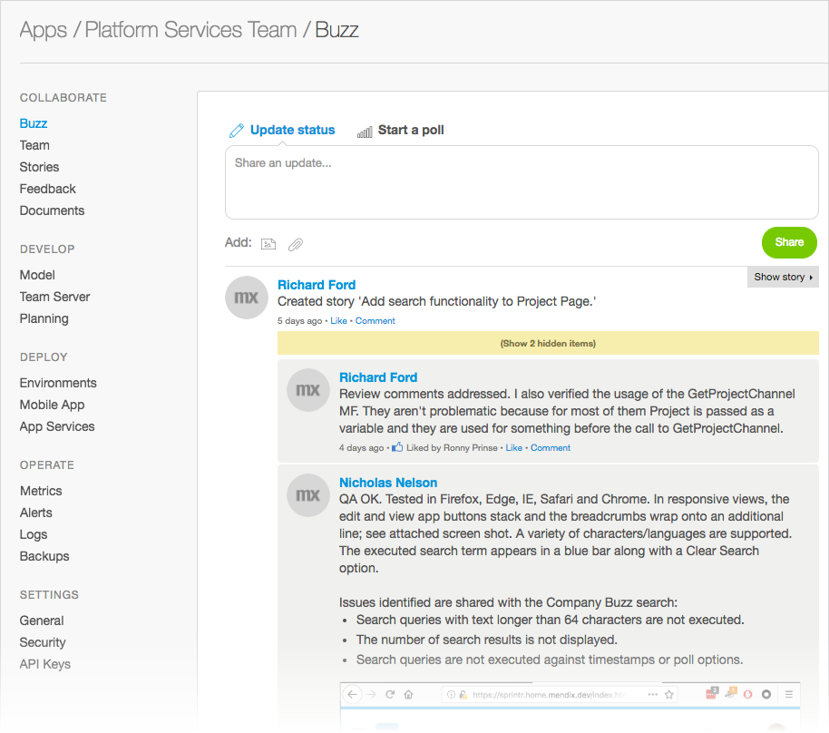
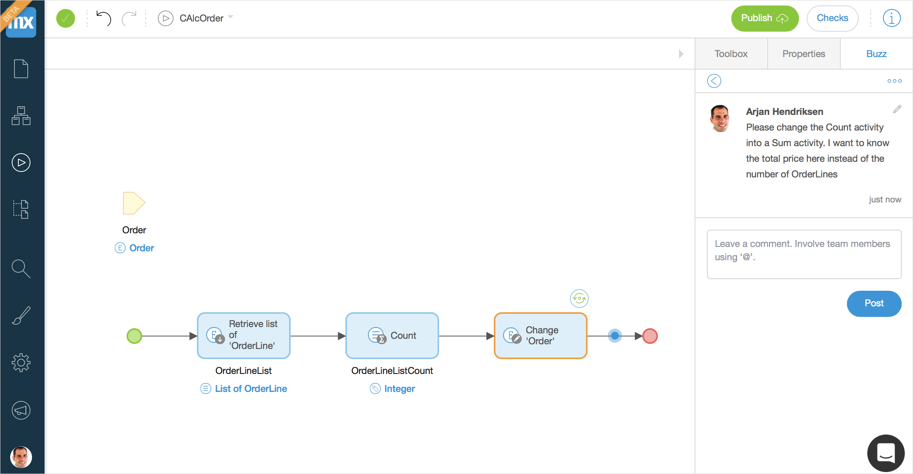
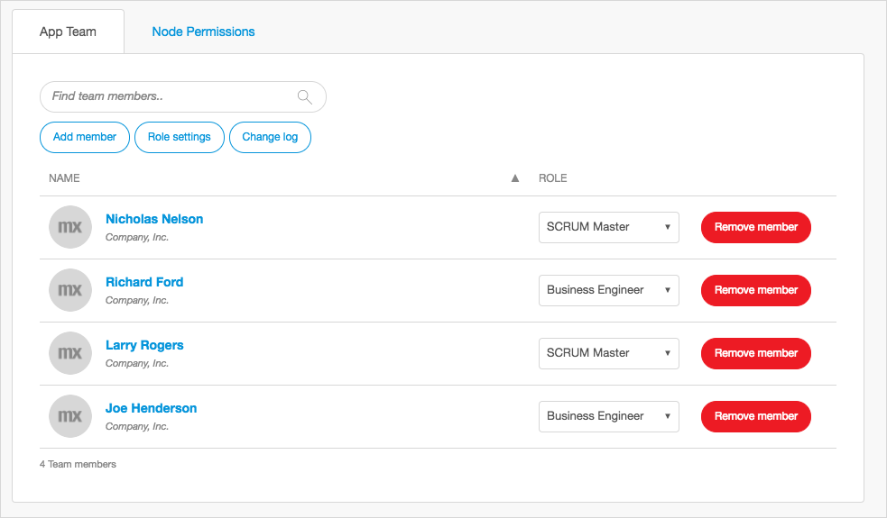

## 1 How Does Mendix Enable Active Stakeholder Involvement in Requirements Management? {#stakeholder-involvement}

The Mendix Developer Portal is the starting point for the development of Mendix projects. Each app has its own central project space, where the development team and their stakeholders can collaborate. This project space provides [backlog management](requirements-management#requirements-management), sprint planning and [user feedback management](feedback-management#feedback-management), development-oriented [DevOps features](devops-overview), and a central social channel, which is the [Buzz](https://docs.mendix.com/developerportal/).

Once development is underway, it is crucial to engage stakeholders in the development process. The Mendix Platform provides various channels of engagement for different stakeholders.

### 1.1 How Can Stakeholders Get Involved via the Mendix Developer Portal?

The [Mendix Developer Portal](https://docs.mendix.com/developerportal/) is the central hub for project management and collaboration. This is usually the place where Product Managers, Product Owners, and similar roles spend their time specifying user stories, reviewing feedback, prioritizing the backlog, and providing their input to the development team through the Buzz.

Users can post updates, comments, photos and upload documents, and publish polls. All updates can be posted both to a Company-wide Buzz channel, as well as to application project-specific Buzz channels.

### 1.2 How Can Stakeholders Get Involved via the Mendix IDE?

As developer are usually found working with the [Desktop Modeler](app-development#desktop-modeler) or the [Web Modeler](app-development#web-modeler), user stories from the active sprint and Buzz are available in the Modelers as well.

### 1.3 How Can Stakeholders Get Involved via the Mendix Mobile App? {#mxapp}

The [Mendix Mobile App](https://docs.mendix.com/refguide/getting-the-mendix-app) enables development teams to closely collaborate with stakeholders on app development in general and mobile app development in particular.

Developers can [preview and test their app](../app-capabilities/mobile-apps#mxapp-preview) on their device, without having to use services like Test Flight, or publish apps to public app stores. The app are loaded into the Mendix Mobile app and can then also be [shared](../app-capabilities/mobile-apps#mxapp-share) with other developers, key end-users, and stakeholders, which can in turn provide feedback through the Feedback Widget. End-users can preview apps under development with the Mendix Mobile App as well as follow the Buzz.

Anyone collaborating on app development with Mendix—whether you are a developer, product manager, key end-user, or another stakeholder—can easily take part in the conversation around the development of the app at any time with the Buzz functionality in the Mendix mobile app.

<<<<<<< HEAD

=======

>>>>>>> 379dbf2eeec7337fcaa0f84c419636c16ea67aa9

### 1.4 How Can Stakeholders Get Involved via Email Notifications?

All the users involved in a Mendix application project receive relevant and timely email notifications for Buzz and other updates of interest. This includes responses to submitted feedback items and status changes such as feedback items that are completed.

<<<<<<< HEAD
{}[**Add screenshot of email notification for buzz update**]{}
=======
{}Screenshot of email notification for buzz update{}
>>>>>>> 379dbf2eeec7337fcaa0f84c419636c16ea67aa9

### 1.5 How Can Stakeholders Get Involved via the Central Buzz? {#buzz}

All of the above channels are bundled together through the central Buzz in the Developer Portal. This is where you can post messages from the context of your project activity. For example, user stories and feedback items each have their own Buzz thread. All the updates posted are visible in the Developer Portal and the Mendix mobile app in a central Buzz stream.

## 2 How Do I Invite Users & Other Stakeholders to Collaborate With the Development Team?

New team members can be easily invited to the (extended) development team. Users are authorized for this action based on their user role as part of the role-based access control model.

When you are invited to collaborate on an application project, you receive an invitation email from the Mendix Platform. This invitation contains a link to the platform with which you can immediately access the application project space to which you were invited.

If you receive an invitation but don't have a Mendix Account yet, the Mendix Platform will provide you with a signup form to complete, and an [onboarding experience through which you quickly learn the ins and outs of Mendix](../evaluation-learning/getting-started#where-do-i-start), after which you can start collaborating with the development team on their application project.

<video controls src="attachments/DO_InviteUserToProject-1.mp4">Inviting a user to your app team</video>

## 3 How Can I Manage the Access of Different Users to My App Project Resources?

Application development project resources are centrally managed from the Mendix Developer Portal with an advanced role-based access control model. Users can have different roles, which can be configured to allow users different levels of access to project resources. For example, some users might be allowed to make changes to the product backlog, while others might get access to the app model in the Team Server repository.

<<<<<<< HEAD
=======
By default, Mendix provides a set of sensible user roles, such as Scrum Master, Business Engineer, Product Owner, Application Operator, and End User. These roles can be modified to suit your particular organization's access management requirements.

For more information on team roles, see [Roles Within the Company and Apps](https://docs.mendix.com/developerportal/general/roles) in the Mendix documentation. See the section on [Platform Security](../enterprise-capabilities/platform-security) for more details on general Mendix Platform security specifications.
>>>>>>> 379dbf2eeec7337fcaa0f84c419636c16ea67aa9
