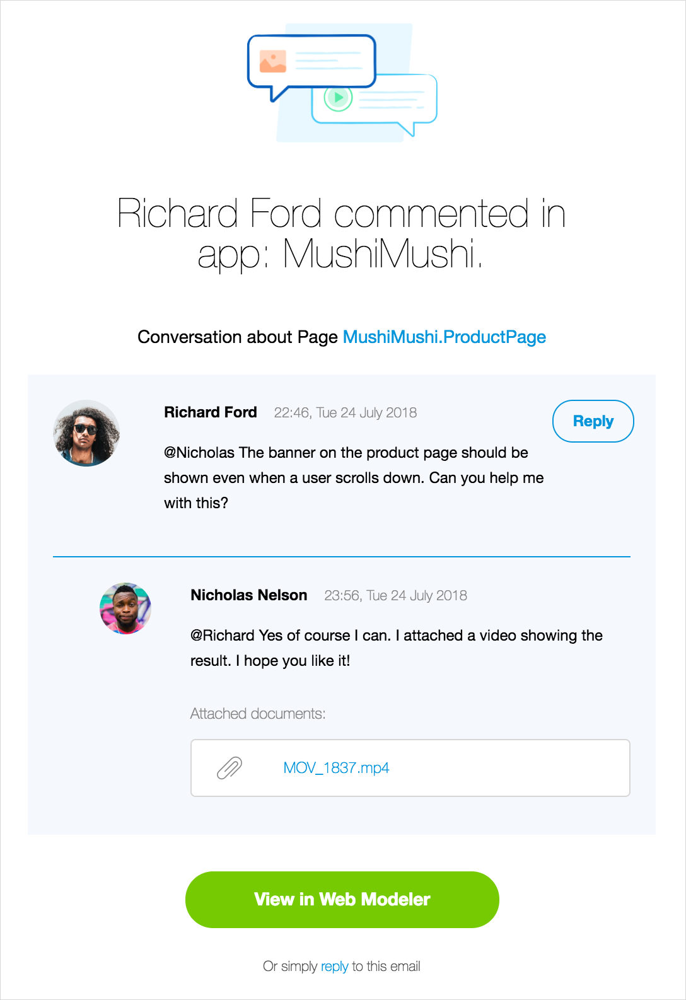

## 1 How Does Mendix Support Feedback Management? {#feedback-management}

Collecting feedback from users and other stakeholders, prioritizing the feedback, and acting on crucial items is essential to the success of application delivery projects, both during development and after go-live. The Mendix Platform provides development teams with advanced feedback management features:

* Collection of feedback from users
* Communication channels with users for submitted feedback
* Feedback deduplication & management features
* Feedback prioritization
* Planning, progress & resolution status notification features

This functionality enables a very fast feedback loop between the development team, key end-users, and other stakeholders, in turn enabling quick improvement of the app under development. And the management features enable development teams to fully integrate user feedback into their natural development cycle

### 2 How Can Users Provide Feedback on Applications to the Development Teams?

Mendix provides a [Mendix Feedback Widget](https://appstore.home.mendix.com/link/app/199/) that empowers the end-users of an app to submit feedback from the context of the app itself. Feedback items are submitted through the widget into the [Feedback](https://docs.mendix.com/developerportal/collaborate/feedback) section of the app project in the Developer Portal. This allows end-users to very easily provide valuable feedback to the development team on the app under development.

<video controls src="attachments/OE_FeedbackAPI_CreateFeedback-1.mp4">Provide the development team with feedback from any app</video>

### 3 How can Development Teams Communicate with Users About Submitted Feedback?

The development team can review and triage feedback items in the **Feedback** section of the Developer Portal. They can communicate with the submitter of the feedback item through messages on the Buzz thread under the feedback item.

End-users can keep track of submitted feedback through the Developer Portal and post updates and replies to questions. As with all Buzz activity, email notifications are sent when someone replies to your post. Users can quickly open the Developer Portal from those emails, or just reply by email to post a response.

### 4 How Can Development Teams Manage, De-Deduplicate & Prioritize Feedback?

Once the team understands the feedback, they can decide on whether or not to accept it. This is an important step in the feedback management process, because it allows the team to also immediately close feedback items, e.g. to get rid of duplicate feedback items, or close feedback items that have already been resolved, without polluting the user story backlog with low-priority items.

When the team decides to accept a feedback item, it becomes a user story in the backlog of their app project. The Product Owner can then prioritize these stories in the context of the broader product backlog. This enables the develoment team to focus on what's truly important and schedule these user stories as part of their sprint planning.

{}

{}

### 5 How Do Users Get Notifications on Planning, Progress & Resolution Status Changes?

### 5.1 Notifications for Accepted Feedback

After a feedback item is accepted, a user story is created and associated with the feedback item. At this point, a notification email is sent to the submitter of the feedback item, informing the user that the feedback has been accepted.

### 5.2 Notifications for Scheduled Feedback

The user story is created in the backlog and associated with the feedback item. The story can then be scheduled in a sprint. When a story is scheduled, an notification email is again sent to the submitter of the corresponding feedback item, informing the user of this.

### 5.3 Notifications for Completed Feedback

At the end of every sprint, when the active sprint is closed and the next sprint is opened, all the feedback items that were scheduled as user stories are closed, and status change notification emails are sent to the respective submitters.

### 5.4 Notifications for Buzz Message Updates

As with all other Buzz message threads in the Mendix Platform, any updates posted in the buzz message thread under feedback items is sent as notification email.

## 6 How Can I Integrate My Existing User Feedback Tracking System with Mendix?

In some scenarios, you might already have an existing User Feedback Tracking system in place that you would like to use in your Mendix apps. Through the creation and use of [custom widgets](../enterprise-capabilities/extensibility#custom-widgets), you can integrate any client-side User Feedback Tracking system into your Mendix apps. For server-side integrations, Mendix' [integration](../app-capabilities/integration) capabilities can be used, or in the rare case that total flexibility is required, [custom java actions](../enterprise-capabilities/extensibility#connector-kit) can be created.
