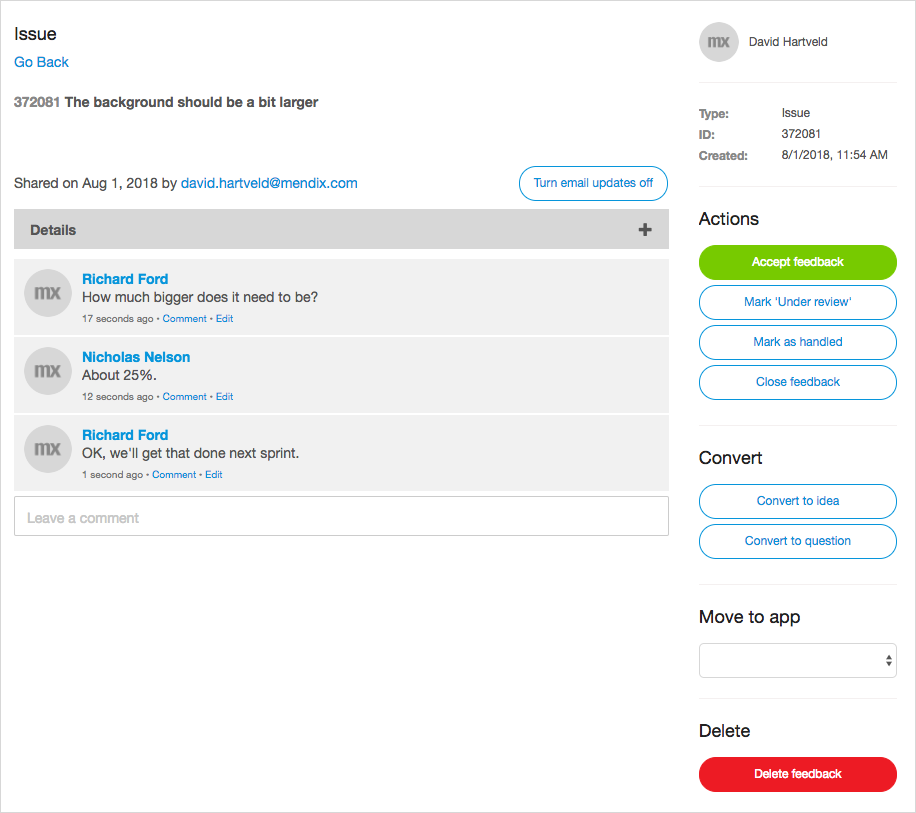
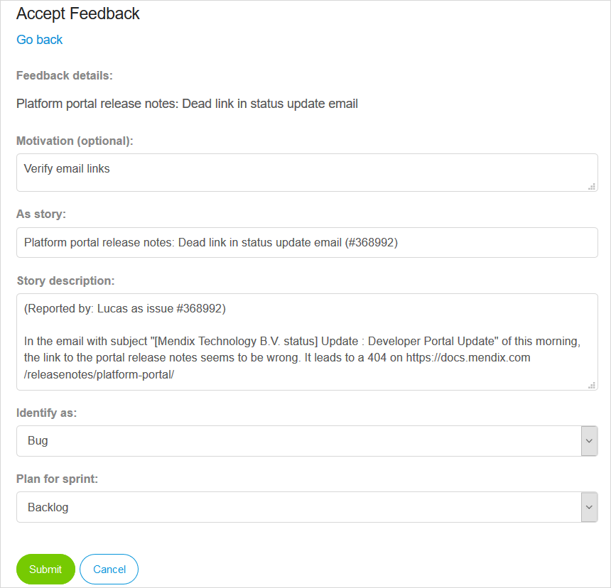

## 1 How Does Mendix Support Feedback Management? {#feedback-management}

Collecting feedback from users and other stakeholders, prioritizing the feedback, and acting on crucial items is essential to the success of application delivery projects, both during development and after go-live. The Mendix Platform provides development teams with the following advanced feedback management features:

* Collection of feedback from users
* Communication channels with users for submitted feedback
* Feedback management and de-duplication features
* Feedback prioritization
* Planning, progress, and resolution status notification features

This functionality enables a very fast feedback loop between the development team, stakeholders, and key end-users, in turn enabling quick improvement of the app under development. The management features enable development teams to fully integrate user feedback into their natural development cycle.

## 2 How Can Users Provide Feedback on Applications to the Development Teams?

Mendix provides the [Mendix Feedback Widget](https://appstore.home.mendix.com/link/app/199/) to empower end-users to submit feedback from the context of the app itself. Feedback items are submitted through the widget into the [Feedback](https://docs.mendix.com/developerportal/collaborate/feedback) section of the app project in the Developer Portal. This allows end-users to easily provide valuable feedback to the app development team.

<video controls src="attachments/OE_FeedbackAPI_CreateFeedback-1.mp4">VIDEO</video>

For every submitted feedback item, the Mendix Platform automatically collects the following metadata to help the development team:

* Information about the user who submitted the feedback item
* The page that was visible on the screen when the feedback item was submitted
* A screenshot of the page as it looked when the user submitted the feedback
* The application-level user role the user had 
* The browser the user was using and the resolution of their screen

When a feedback item is accepted, the associated user story has the same metadata associated to it. When the story is scheduled in the current sprint, it becomes visible in the Desktop Modeler. From there, developers can click a link to open the page that was visible when the feedback item was submitted.

## 3 How Can Development Teams Communicate with Users About Submitted Feedback?

The development team can review and triage feedback items in the **Feedback** section of the Developer Portal. They can then communicate with the submitter of the feedback item through messages on the Buzz thread under the feedback item.

{}

{}

End-users can keep track of submitted feedback through the Developer Portal and post updates and replies to questions. As with all Buzz activity, email notifications are sent when someone replies to your post. Users can quickly open the Developer Portal from those emails, or just reply by email to post a response.

{}

{}

## 4 How Can Development Teams Manage, De-Deduplicate & Prioritize Feedback?

Once the team understands the feedback, they can decide on whether or not to accept it. This is an important step in the feedback management process, because it allows the team to immediately close feedback items (meaning, to get rid of duplicate items and close items that have been resolved) so that they do not pollute the backlog with low-priority items.

When the team decides to accept a feedback item, it becomes a user story in the backlog of their app project. The product owner can then prioritize these stories in the context of the broader product backlog. This enables the development team to focus on what is truly important and schedule these user stories as part of their sprint planning.

{}

{}

## 5 How Do Users Get Notifications on Planning, Progress & Resolution Status Changes?

Communication between the submitter of a feedback item and the development team needs to be smooth. As feedback items are handled by the development team and progress through different states, notifications will be sent out to the item submitter at various points.

### 5.1 Notifications for Accepted Feedback

After a feedback item is accepted, a user story is created and associated with the feedback item. At this point, a notification email is sent to the submitter of the feedback item, informing them that the feedback has been accepted.

### 5.2 Notifications for Scheduled Feedback

When the user story is created in the backlog and associated with the feedback item, the story can be scheduled in a Sprint. When that happens, a notification email is sent to the submitter informing them of this.

### 5.3 Notifications for Completed Feedback

At the end of every Sprint (when the active Sprint is closed and the next Sprint is opened), all the feedback items scheduled as user stories are closed.  Status change notification emails are then sent to the respective submitters.

### 5.4 Notifications for Buzz Message Updates

As with all other Buzz message threads in the Mendix Platform, any update posted in the Buzz message thread under feedback items is sent as a notification email.

## 6 How Can I Integrate My Existing User Feedback Tracking System with Mendix?

In some scenarios, you might already have an existing user feedback tracking system in place that you would like to use for your Mendix apps. Through the creation and use of [custom widgets](../enterprise-capabilities/extensibility#custom-widgets), you can integrate any client-side user feedback tracking system. For server-side integrations, Mendix's [integration](../app-capabilities/integration) capabilities can be used, and in the rare case that total flexibility is required, [custom Java actions](../enterprise-capabilities/extensibility#connector-kit) can be created.
