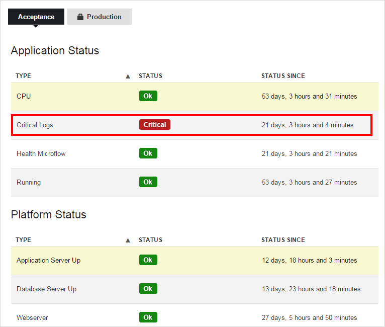

{}**[David: NOTE: Erno & Andrej should review this section.]**{}

{}**[David: TODO: Mention APM somewhere.]**{}

## 1 How Do Mendix Platform Monitoring Solutions Support Development Teams that Adopt DevOps?

The Mendix Platform enables development teams to not only develop but also maintain and support applications with enterprise-grade non-functional requirements. Mendix provides a number of monitoring solutions out of the box in order to support development teams. Trend graphs and alerts are available for the full application stack, and live logging and debugging make it possible to quickly diagnose issues as they happen in production.

Development teams can use the [Mendix Application Performance Monitor](https://docs.mendix.com/apm/) (APM) to continuously monitor and measure performance of their apps in order to diagnose and resolve performance issues. Mendix APM provides point-in-time visibility, tracking, and diagnostics into Mendix Runtime performance at both a high level for user experience performance and at the lowest possible level for details on microflow activity performance. This allows you to continuously improve your app's performance and user experience.

Mendix APM provides this experience through the following tools:

* Trap Tool – continuously records all levels of logging and stores it when an error occurs
* Statistics Tool – identifies trends by gathering statistics on application performance
* Performance Tool – analyzes individual functions and visualizes where improvement is possible
* Measurements Tool – monitors the CPU and memory, performs measuring queries, and alerts if a limit is exceeded

Customized monitoring is available through integration with third-party services like [New Relic](https://docs.mendix.com/howto/monitoring-troubleshooting/manage-application-performance-with-new-relic), [Datadog](https://www.datadoghq.com/), and [AppDynamics](https://docs.mendix.com/howto/monitoring-troubleshooting/manage-application-performance-with-appdynamics). Alternatively, [JMX integration](https://docs.mendix.com/howto/monitoring-troubleshooting/monitoring-mendix-using-jmx) is available, and the Mendix Runtime provides an [easy-to-program REST-based proprietary interface](https://docs.mendix.com/refguide/monitoring-mendix-runtime) for custom solutions.

Depending on the deployment scenario, different solutions are available to development teams. The sections below present details on specific scenarios.

## 2 How Do I Monitor My Mendix Apps Running on the Mendix Cloud?

Any licensed app running in the Mendix Cloud can leverage the full monitoring capabilities provided by the Mendix Platform. These include out-of-the-box trend graphs, fully automated alerts, live logging and debugging, and available log archives. With these capabilities, development teams can maintain, operate, and support apps through their lifecycle.

{}

{}

This is a historical overview of alerts:

{}

{}

Besides these monitoring features, the Mendix Cloud provides high availability features that can be enabled for any app in order to achieve enterprise-grade service availability.

When third-party services (like New Relic, Datadog, and AppDynamics) are integrated, development teams can leverage the advanced monitoring capabilities provided by these services to increase the service level of their applications even further.

See the section on the capabilities of the Mendix Cloud for more details on the [features available to development teams for monitoring](../app-capabilities/mendix-cloud#cloud-portal).

For more details, see the section [Which Features Are Available in the Mendix Cloud?](../app-capabilities/mendix-cloud#cloud-portal) in *Mendix Cloud*.

## 3 How Do I Monitor My Mendix Apps Running on SAP Cloud Platform or IBM Cloud?

{}**[David: TODO: Andrej/Erno need to review this section & provide further input. What is possible on SAP CP? What is possible on IBM Cloud?]**{}

SAP Cloud Platform supports [monitoring through JMX interfaces](https://blogs.sap.com/2018/02/17/monitoring-and-tuning-java-applications-deployed-on-scp/).

{}**[David: TODO: Monitoring on IBM Cloud -- Andrej has input]**{}

## 4 How Do I Monitor My Mendix Apps Running on Premises?

Mendix supports integration with third-party monitoring products, both tools and services.

Any tool that supports [JMX](https://docs.mendix.com/howto/monitoring-troubleshooting/monitoring-mendix-using-jmx) can be used to monitor Mendix applications. If your tool of choice does not support JMX, it is still possible to set up monitoring if the tool supports custom integrations. This is because the Mendix Runtime exposes [a simple REST-based API to retrieve monitoring data](https://docs.mendix.com/refguide/monitoring-mendix-runtime).

Finally, third-party services (like New Relic, Datadog, and AppDynamics) can be integrated to improve monitoring capabilities.
