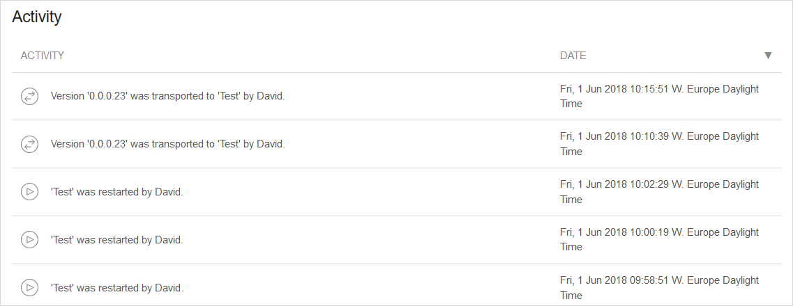
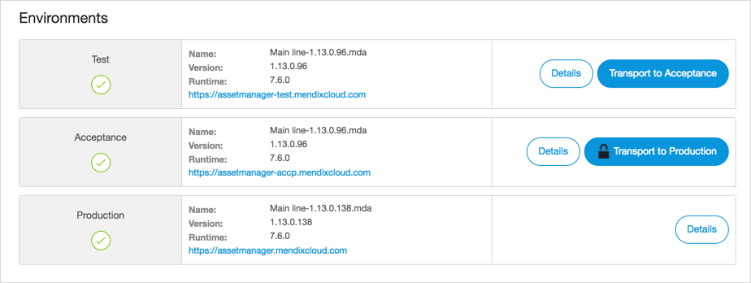

## 1 How Does Mendix Support Staging & Deployment?

Staging and deployment is an essential part of the DevOps process, and having proper governance and control in place allows developers to release new versions of their code rapidly. Building this process can often be complicated, as it requires many moving parts. The Mendix Platform provides integrated tooling to support the staging and deployment of applications, both into the Mendix Cloud but also into other PaaS providers such as SAP Cloud Platform, Pivotal, AWS, Azure, and IBM Bluemix.

## 2 How Do I Deploy My Apps as Part of the Release Process?

Before deploying an application, a deployment package is required. Using the Mendix Build Server, applications are automatically built and packaged in the cloud. The Build Server will generate a Mendix Deployment Archive (MDA), which contains all the relevant assets to deploy your application.

<video controls src="attachments/DO_BuildingRevisionFromCloudPortal.mp4">Create a versioned deployment package from the Mendix Developer Portal</video>

{}**[Note from Adam: why is this video used here and in 4.2? Should just be used once.]**{}

Once a revision of the application is created in the Deployment Package Repository, it can be staged into one of the available environments. The Mendix Developer Portal allows you to do this with just a few clicks.

{}**[David: TODO: Add video showing staging/deployment.]**{}

Development teams can fully automate this process by leveraging the [Deploy API](https://docs.mendix.com/apidocs-mxsdk/apidocs/deploy-api) in their [CI/CD tools and services of choice](cicd#cicd-other-tools).

All deployment activities on the Mendix Platform are logged and visible in the Developer Portal. You can review the Activity Log for each environment to identify the user who executed operations on your app's environments.

{}

{}

## 3 How Can I Trace Released Changes Back to Requirements?

When you commit the changes you have made to your app model in the Mendix Modeler to the Team Server, you can [mark the relevant user story from your active sprint](version-control#cross-reference). This cross-referencing metadata is stored in the Mendix Team Server, so you can trace changes back to requirements later in the development process. For more details, see [Version Control](version-control).

## 4 How Many Environments Can I Provision for My Apps?

In the Mendix Cloud, environments are provisioned to allow for staged deployment. Typically, most application nodes come with either two environments (acceptance and production) or three environments (test, acceptance, and production). The Mendix Platform can accommodate additional environments to fit with your DevOps process.

{}

{}

Staging and deployment to each of these environments can be automated with the [Deploy API](https://docs.mendix.com/apidocs-mxsdk/apidocs/deploy-api) so that [development teams can set up fully automated CI/CD pipelines](cicd#cicd-other-tools) for their Mendix apps.

## 5 What Controls Are Available to Secure the Production Environments of My Apps?

In the Mendix Cloud, access controls are in place to only allow certain users access to view, deploy, and manage different environments. This allows for the segregation of responsibilities when deploying to different staged environments.

<video controls src="attachments/NodePermissions2.mp4">Fine-grained permission control for all users in the development team</video>

To deploy an application into a production environment, users must authenticate using two-factor authentication, either by Google Authenticator or SMS. The token changes every 30 seconds. Once authenticated, you will be able to perform operations in production for up to 8 hours, after which you will be required to authenticate again.

<video controls src="attachments/DO_GoogleAuthenticator.mp4">Production operations are secured through two-factor authentication</video>

## 6 How Does Mendix Support Staging & Deployment to Other Platforms?

Besides the Mendix Cloud, Mendix supports deployments on many different platforms, such as SAP Cloud Platform, IBM Cloud, Azure, AWS, VPC, and on-premises scenarios. For details on all the deployment capabilities of the Mendix platform, review the  [Multi-Cloud Overview](../app-capabilities/multi-cloud-overview).
