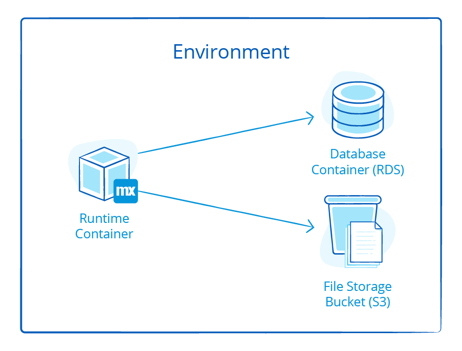
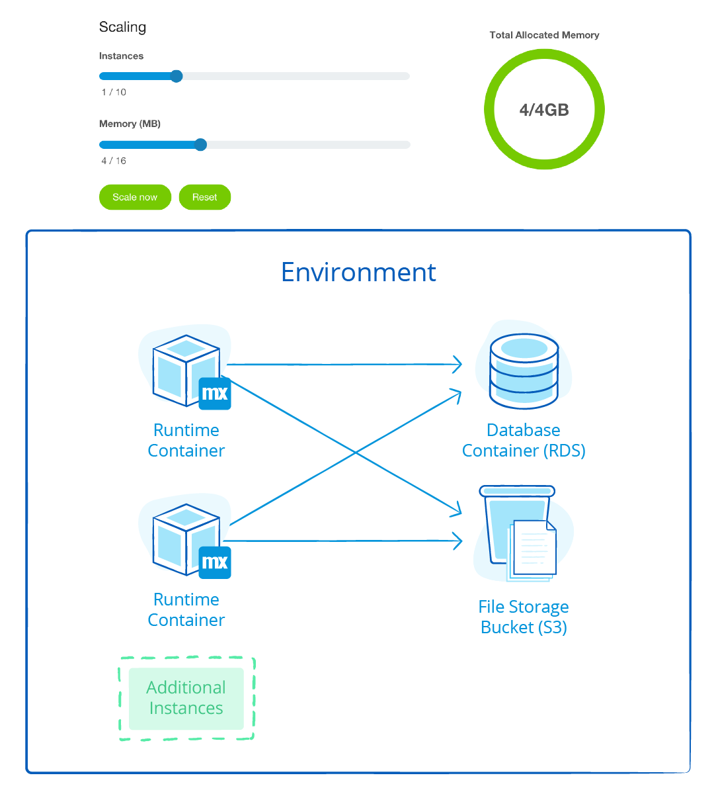

## 1 What Does the Mendix Deployment Architecture Look Like?

Mendix Cloud is a PaaS based Cloud Offering based on Cloud Foundry technoligy. It runs on the IaaS layer of Amazon Web Services. A Mendix application will run in a container provided by Cloud Foundry. A Container in Cloud Foundry has standard support for horizontal and veritcal scaling and auto healing.

Scaling up and down can be done without any downtime, it is just a matter of adding container or removing containers.

The Mendix Cloud Foundry layer is for each AWS region deployed in mulitple availability zones. An availability zone is physical datacenter location of AWS witin a region.

Mendix application needs a database and file storage to operate. In the Mendix cloud these aPaaS services are directly consumed from the AWS service layer. For the database the Mendix Cloud makes use of RDS PostgreSQL and for the file store S3. Both these services are multi AZ configured so data will be repicated accros datacenters.

{}

{}

## 2 Where Does Mendix Host My Application?

The Mendix Cloud can provide hosting facilities in the US, APAC, and the EU.

Mendix guarantees that the data will not leave the region, should your company require this.

For details, see the [Multi-Cloud Overview](../app-capabilities/multi-cloud-overview).

## 3 How Is Application Isolation Organized?

Within Mendix Cloud we make use a logical term called App Container to describe the Application isolation within Mendix Cloud. Each Application is fully separated from each other on both compute, memory and storage. A Mendix application runs in 1 or more containers, where a container can only support a single application. Also, for each application a dedicated database and s3 bucket is provisioned to have full isolation on data level as well.

{}

{}

## 4 How Does Mendix Cloud Offer High Availability? {#cloud-ha}

The Mendix Cloud offers high availability for all app environments, ensuring zero downtime in the case of a Mendix Runtime outage. Users are able to scale Mendix app environments using the Cloud Portal. When selecting a minimum of 2 containers the application will run in high availability mode.

{}

{}

## 5 How Does Mendix Provide Disaster Recovery? {#cloud-dr}

Mendix Cloud architecture automatically applies failover between availability zones. Database containers and file storage buckets are automatically replicated across multiple availability zones. All backups are copied to other data centers, but the data will not leave the region, should your company require this.

{}

{}

## 6 How Does Mendix Cloud Provide Auto-Recovery & Auto-Healing? {#cloud-ar}

The Mendix Cloud enables auto-recovery and failover within the same availability zone, and the user load is balanced over two runtime containers. In the rare occurrence that a single runtime container crashes, the other runtime container automatically takes over all user requests while the Cloud Foundry Health Manager automatically replaces the crashed runtime container with a new runtime container. Because of the stateless architecture of Mendix, end-users will not be impacted in this scenario.

{}

{}
