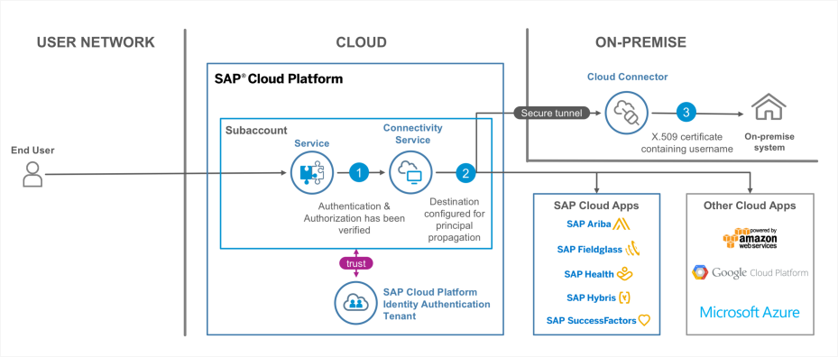
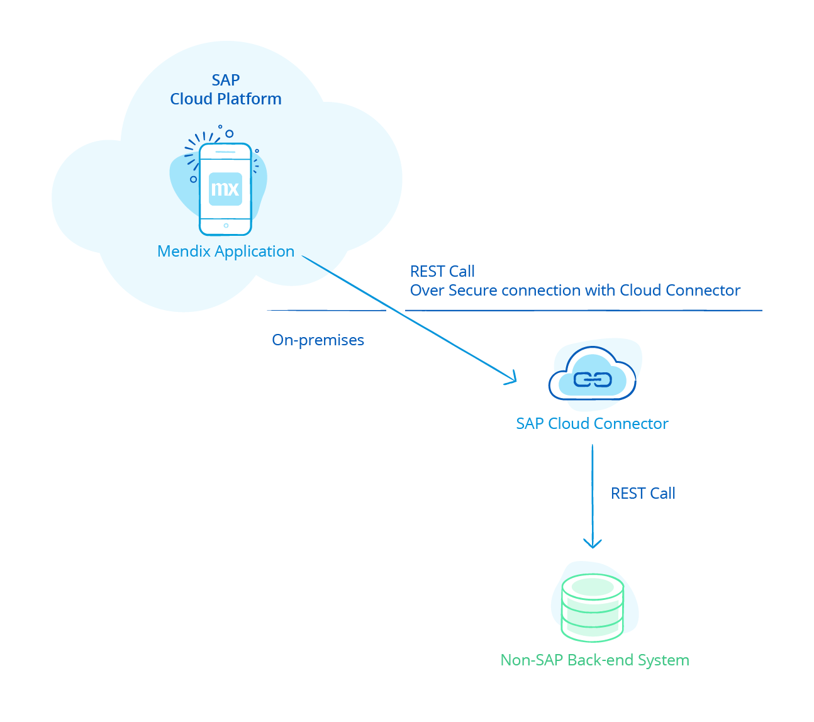
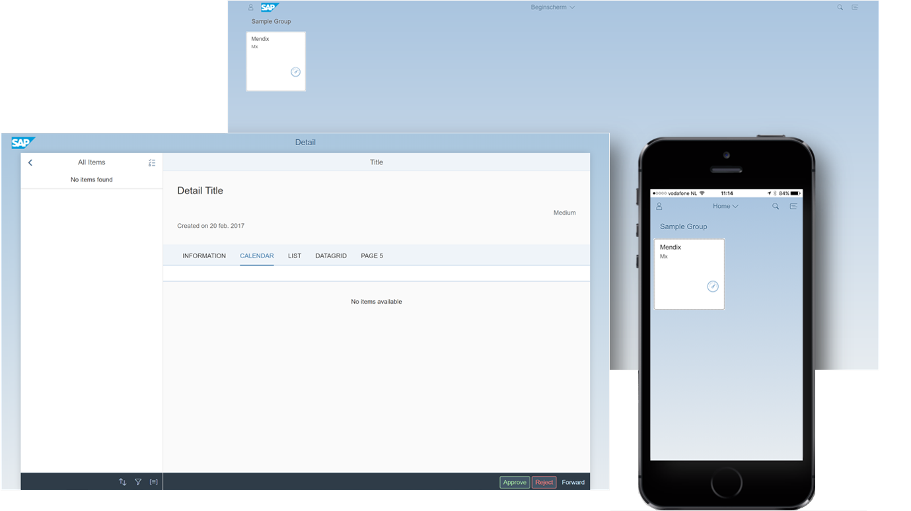

## 1 How Can I Deliver a Single Sign-On Experience in My Mendix Apps Extending SAP?

SAP Cloud Platform comes with a standard identity provider (IDP) integration, also known as a trust configuration within the SAP Cloud Platform. This is a standard SAML2-based trust between your IDP and the SAP Cloud Platform.

After configuring this trust, a Mendix application automatically integrates with the IDP. By mapping the Mendix application roles with the self-defined SAP Cloud Platform roles attached to your IDP, you can log in to the Mendix app with the specific assigned role using your corporate identity.

For more details, see [How to Use the SAP XSUAA Connector](https://docs.mendix.com/howto/sap/use-sap-xsuaa-connector).

## 2 How Does Mendix Support Principle Propagation Between My Mendix App & the SAP Back-End System? {#principle}

In combination with the SAP Cloud Platform, Mendix delivers an integration with SAP back-end systems based on [SAP principle propagation](https://www.sap.com/developer/blueprints/finder/cloud-platform-principal-propagation.html) both on-premises and for cloud. By connecting your IDP to the SAP Cloud Platform, it becomes possible to log in to all of your Mendix applications running on the SAP Cloud Platform via a specific role using your own IDP with an SSO experience. The end-user (called "the principle") then gains access to your SAP back-end system based on a trust configuration using the Cloud Connector (as the principle user).

For on-premises systems, this is realized by setting up a trust between the SAP Cloud Connector, SAP Cloud Platform, and SAP Cloud Connector with your SAP back-end system. For SAP Cloud Platform solutions, this is done using an SAM2-to-oAuth assertion using a destination service, as presented in this diagram:

## 3 How Can I Use the SAP Cloud Connector to Integrate Mendix with Non-SAP Apps?

The SAP Cloud Connector allows you to set up connections to any end-point within your premises. Because the SAP Cloud Connector acts as a secure reverse proxy, the Mendix native REST and web services integrations have been extended with the support to configure the use of the SAP Cloud Connector. This makes it possible to integrate with any REST-based or web services (SOAP)-based solution within your premises when running your Mendix application within the SAP Cloud Platform.

## 4 How Does Mendix Support Extending Cloud Services like SAP SuccessFactors and SAP Hybris?

Cloud solutions like SAP SuccessFactors, SAP Hybris, SAP Concur, and SAP Ariba are all enabled with OData support. Using the Mendix [SAP OData Connector](https://appstore.home.mendix.com/link/app/74525/), Mendix applications can also integrate with these SAP Cloud Platform solutions. This integration also includes support for principle propagation.

## 5 How Can I Use SAP Data Within My Mendix App?

Together with SAP, Mendix has created an API discovery solution based on OData metadata files and SAP API Business Hub integration. This allows you to generate a Mendix domain model within your application from any SAP service in order to represent the data set of your service.

Along with the SAP OData Connector, this allows you to consume any service provided by SAP within a few clicks.

## 6 How Can I Integrate Mendix with SAP Fiori? {#integrate-with-sap-fiori}

The Mendix SAP integration comes with a standard application template for SAP Fiori-styled applications. This template includes the primary SAP Fiori page layout and theming, so your application can be used within the SAP Fiori launchpad next to your existing SAP Fiori applications.

Mendix applications can even been used within the SAP Fiori mobile launchpad, with the support of native mobile integrations.

## 7 Why Should I Use OData Instead of BAPI?

The standard integration protocol that SAP uses for extending SAP products is the Open Data Protocol (OData). OData is an ISO/IEC-approved OASIS standard that defines a set of best practices for building and consuming RESTful APIs. As OData is based on REST, it is fully optimized for both cloud and on-premises integrations. This is reason why SAP positions the use of OData above using traditional BAPI integrations with your SAP products.

Another reason to use OData is that in addition to SAP Business Suite and SAP S/4 HANA being OData-enabled, cloud products like SAP SuccessFactors, SAP Ariba, SAP Concur, and SAP Hybris are also OData- enabled. This gives you a single integration experience between all the SAP products available.

For SAP Business Suite, SAP Gateway (also known as SAP NetWeaver) is used to publish services in OData. This is supported for both standard and custom (Z-) services in your SAP Business Suite stack.

Based on this strategy, the jointly-owned integration between the Mendix Platform and SAP is based on OData. This does not  exclude the ability to also use BAPI, but it is not recommended by either SAP or Mendix.

<video controls src="attachments/CreateSAPAppSmaller.mp4">VIDEO</video>
