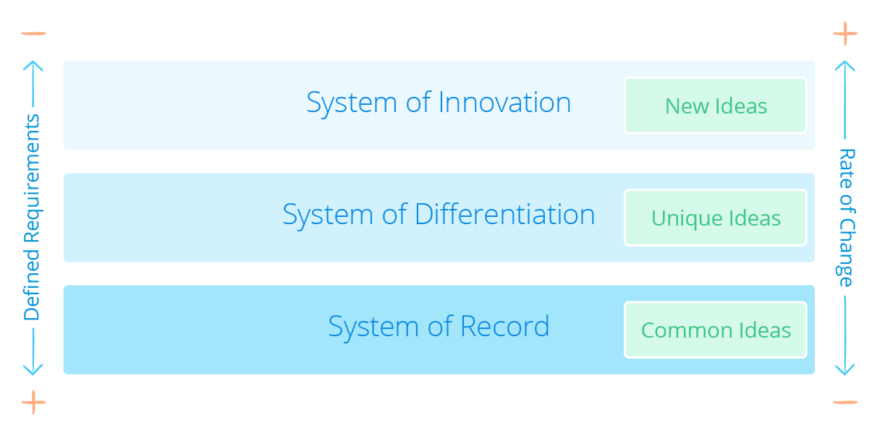
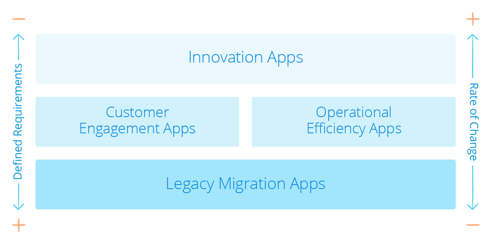

## 1 In General, What Can I Build with Mendix? {#can-i-build}

With Mendix, you can build a wide range of transactional, event-driven, and adjacent applications for all kinds of industries, regardless of complexity, performance, or [scale](enterprise-capabilities/architecture-principles#statelessness).

The [Mendix App Gallery](https://gallery.mendix.com) showcases all kinds of applications built using the Mendix Platform. These applications are there to present you with the art of the possible.

## 2 What Types of Projects Are a Good Fit for Mendix? {#good-fit}

Based on Gartner’s [Pace-Layered Model](https://www.gartner.com/binaries/content/assets/events/keywords/applications/apn30/pace-layered-applications-research-report.pdf), an organization’s application landscape is made up of three distinct layers with a corresponding rate of change. This rate of change is dictated by the uniqueness of the solutions and how concrete the requirements are.

At the bottom of the model, you have the system of record, which is the foundation of the business. This a structurally solid system with a slow rate of change and well-defined requirements. In the middle, you have the system of differentiation, which focuses on fostering outside-in and customer-centric thinking, accelerating the rate of change, and developing unique approaches to sustain differentiation. At the top, you have the system of innovation, which represents brand new ideas for the organization and thus has fuzzy requirements and a high rate of change.

Mendix helps most in projects where the requirements are not completely defined up front and in projects that have a high rate of change. In line with Gartner’s Pace-Layered Application Strategy, a system of differentiation or innovation matches these criteria. For a system of record, Mendix is a good fit if one of the following points is applicable:

* The application is not available off the shelf
* The off-the-shelf solution is too complex and/or or too expensive
* The customer needs customization
* The customer needs to differentiate against competitors
* The customer wants more control over future capabilities

The following types of projects are a natural fit for Mendix:

*  **Systems of innovation projects** that are built to create new ways of working – often customers do not know exactly what they need, so they need to experiment before and after the app's go-live
*  **Systems of differentiation projects** that extend on core systems projects – customers have an idea of what they would like to have, and it needs to be different from their competitors
*  **Unique systems of records projects** that modernize legacy systems –  customers typically know exactly what they would like to have and the solution is not available off the shelf, since it is a unique system

With fluid requirements and a high rate of change, these types of projects require small cross-functional teams, rapid iteration and releases, and a unified innovation platform like Mendix.

## 3 What Are Common Use Cases for Mendix Applications?

Based on the experience of Mendix's hundreds of enterprise customers, there are four common use cases that are perfect fits for developing with a low-code platform like Mendix.:

* [Innovation apps](#innovation-apps)
* [Customer engagement apps](#customer-engagement-apps)
* [Operational efficiency apps](#operational-efficiency-apps)
* [Legacy migration apps](#legacy-migration-apps)

These are the four use cases mapped to the Gartner's Pace-Layered Model:

The sections below describe these common use cases in detail.

## 4 How Does Mendix Support Innovation Apps? {#innovation-apps}

Innovation applications stem from ideas for new digital business models, products, and channels to help grow and differentiate the organization. Often, they leverage emerging technologies like IoT, AI, and machine learning to unlock new sources of value. Because innovation apps start as ideas (with loose and fuzzy requirements and a high rate of change), they require a high degree of business involvement throughout the entire development process.

These are the key features that enable you to build innovation apps in Mendix:

* [The Mendix Web Modeler](app-lifecycle/app-development#web-modeler) enables business users to build prototypes that development teams can continue to enhance via the Desktop Modeler
* [Out-of-the-box connectors](app-lifecycle/app-store#connectors) simplify integrating with third-party databases or applications, handling complex XML messages, and utilize IoT and cognitive services, which enables developers to leverage emerging technologies and legacy systems with minimal dependencies on IT
* [Requirement management](app-lifecycle/requirements-management) via easy-to-use [Developer Portal](app-lifecycle/requirements-management#requirements-management) allows business users to create and track their own user stories, enables the development teams to adopt a Scrum-based development approach and shortens the feedback loop between development teams and the business

Some great examples of innovation apps built with Mendix are AntTail’s [medicine tracking app](https://www.mendix.com/blog/anttail-ensures-quality-medicines-iot/), Solomon Group’s [RFID wristband event access app](https://www.mendix.com/blog/solomon-group-iot-solution/), KLM’s [IoT equipment tracking app](https://www.mendix.com/blog/comes-building-iot-apps-klm-says-just/), and Heijman’s [IoT-based smart building management app](https://www.mendix.com/our-customers/heijmans/).

## 5 How Does Mendix Support Customer Engagement Apps? {#customer-engagement-apps}

Customer engagement applications enable customers and partners to better interact and/or transact with the business, improving satisfaction, retention, and revenue. With these apps, the business has a fairly well-defined idea of the app, but the development team must adapt to issues revealed during the application lifecycle. Customer-facing applications often encounter high expectations from unforgiving users in terms of both usability and seamless, multi-channel access. There are often underlying operational improvements required to support customer-facing processes, and integration with systems of record is required to support the experience layer and existing processes.

These are the key features that enable you to build customer engagement apps in Mendix:

* [Multichannel apps](app-capabilities/ux-multi-channel-apps) can be built once for all channels via the [WYSIWYG page editor](app-lifecycle/user-interfaces#build-pages) that enables users without front-end development or UI design skills to create beautiful, engaging, and highly usable multi-channel apps
* [The Atlas UI framework](app-capabilities/ui-design#atlas-ui) enables you to build pixel perfect apps, and your company's UI/UX team to create a package containing the organization’s design language for use across development teams, ensuring consistency while broadly leveraging the skills of what could be a small UI/UX team
* [Horizontal scalability](enterprise-capabilities/architecture-principles#statelessness) allows additional resources to be added easily as required to support increasing user or processing loads

{}[**Best place to link for horizontal scalability?**]{}

Some examples of customer engagement app built with Mendix are agent/broker portals, customer portals, [self-service policy administration apps](https://www.mendix.com/our-customers/texas-life/), claims management apps, and student service applications for universities.

## 6 How Does Mendix Support Operational Efficiency Apps? {#operational-efficiency-apps}

Operational efficiency applications are employee- or partner-facing applications designed to lower costs by reducing or automating manual or paper-based processes. These apps may support departmental, cross-departmental, or company-wide processes, and they are often driven by compliance needs, particularly in regulated industries. This type of app almost always integrates with core systems. The closer the app is to the core systems of the business, the more critical the operational robustness becomes.

These are the key features that enable you to build operational efficiency apps in Mendix:

* [The Mendix Web Modeler](app-lifecycle/app-development#web-modeler) enables business users to build prototypes that development teams can continue to enhance via the Desktop Modeler
* [Integration options](app-capabilities/integration-overview) for which Mendix offers an extensive array of tools for integrating with other systems
* [The Mendix Cloud](app-capabilities/mendix-cloud-overview) enables you to deploy your apps easily and cost effective to the cloud

## 7 How Does Mendix Support Legacy Migration Apps? {#legacy-migration-apps}

Most legacy migration Mendix application projects are business-driven transformation initiatives. That is, rather than a pure lift-and-shift of existing functionality, these new apps are meant to replace legacy apps that cannot support new processes or provide the right user experience. As such, they require new functionality, but they should also support current processes.

These are the key features that enable you to build legacy migration apps in Mendix:

*  [High Availability](enterprise-capabilities/architecture-cloud#cloud-ha), the Mendix Cloud offers high availability for all app environments, ensuring zero downtime in the case of a Mendix Runtime outage
*  [The Mendix Application Quality Monitor](app-lifecycle/model-consistency#aqm) provides benchmarks into the maintainability of apps based on the ISO 25010 standard, to ensure you don't build tomorrows legacy
*  [Integration options](app-capabilities/integration-overview) for which Mendix offers an extensive array of tools for integrating with other systems
*  [Data migration tooling](app-capabilities/querying-managing-data#migrate-from-existing) integrated in the Mendix platform, like visual data mapping, allows you to create the optimal data model for the new solution (with traceability back to systems of record), not simply recreate the legacy systems’ model

Examples of legacy migrations include transferring legacy [Lotus Notes](https://www.mendix.com/blog/how-one-customer-is-using-mendix-for-legacy-application-migration/), Microsoft Access, SharePoint, or Excel applications to an updated system.

## 8 What Should I *Not* Build in Mendix? {#should-not-build}

While there are endless possibilities for what apps can be built with the platform, we at Mendix do have some advice on what you should not build in Mendix.

If your application can already be bought off the shelf and provides 100% of the requirements you need, then Mendix suggests buying that off-the-shelf product. Buying such a solution is often more cost-effective (based on best practices) and it is faster to implement. Typically, these off-the-shelf solutions are available for traditional system-of-record applications (which have a low rate of change), because the processes are well-established, common to most organizations, and often subject to regulatory requirements. Mendix can extend any application or stay stand-alone.

However, there are situations when the Mendix platform is a good fit even if the app that needs to be built is a traditional system of record. For details, refer to [What Types of Projects Are a Good Fit for Mendix?](#good-fit) above.

In addition to such systems of records, the Mendix Platform is not a good fit for building games or replacing full ESB solutions.

The Mendix Platform allows you to build web, mobile, and tablet applications; therefore, it’s not suitable if you are looking to build apps that are not browser- or mobile-based.
