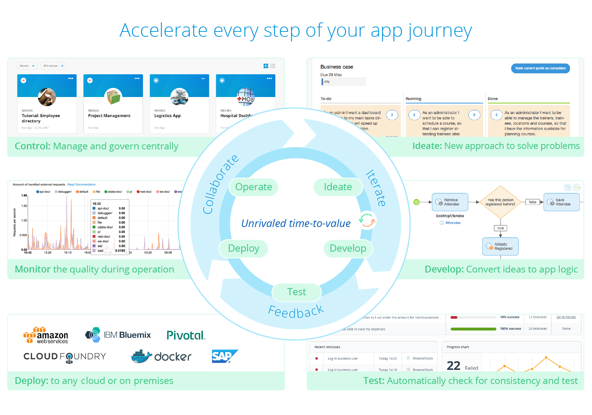

## 1 What Is Mendix?

Mendix is a high productivity app platform that enables you to build and continuously improve Mobile and Web apps at web scale, and gives you control without sacrificing speed and power. The Mendix Platform is designed to accelerate enterprise app delivery across your entire application development lifecycle, from ideation to development, deployment, test and the ongoing management of your application portfolio in the cloud or on premises.

Mendix offers both no-code and low-code tooling in one single platform:

* No-code: collaborative visual modeling by business domain experts
* Low-code: highly extensible and integrated, collaborative tooling to support cross-functional teams

The result: business domain experts such as analysts and citizen developers can work alongside expert developers to achieve much greater levels of business agility and accelerated delivery. Moreover, the Mendix Platform's cloud-native architecture and automation tools support the deployment, management, and monitoring of highly available enterprise-grade applications.

Based on our three core principles of speed, collaboration, and control, Mendix offers a complete platform for your enterprise application delivery needs.

<video controls src="attachments/Bring-Business-Knowledge-Into-the-App-Development-Process.mp4">VIDEO</video> 

## 2 How Does Mendix Support Each App Lifecycle Step?

With Mendix you can accelerate every step of your app life cycle.

### 2.1 Ideation & Requirements Management

The first step of the Application Lifecycle Management process is Ideation. The Mendix Developer Portal enables a new approach to solving problems and facilitates [requirements management](app-lifecycle/requirements-management) of your app development. With capabilities as sprint and story management and integrated feedback management via embedded feedback widgets that enable end-users to provide instant feedback directly within an application. The closed feedback loop enables the development team to quickly resolve queries from the business, facilitating rapid iteration.

The value of collaboration is strengthened through the Mendix Platform’s support for Agile requirements management. Learn about the Agile tools built into Mendix that will help you to manage your projects and teams effectively from day one.

### 2.2 Development & Testing

The next step is to develop your application and *convert ideas into app logic*. Mendix uses visual modeling languages for all the aspects of an application and is designed for a variety of users, while providing powerful capabilities to developers for their day-to-day work.

* Business Analysts and Business Developers can directly use the Mendix Web Modeler to build, review, and collaborate on an app.
Developers with a technical programming background can use the Mendix Desktop Modeler along with Java and JavaScript to build and extend an app.
* Product Owners use the Mendix Developer Portal to govern user requirements, end-user feedback, and sprint backlogs.
* End-users involved in running acceptance tests can use the app in combination with the Mendix Feedback widget. This feedback is directly connected to the Mendix Developer Portal, so the Product Owner can review and validate the user feedback.

With Mendix, development is visual from start till finish, making sure the customer is engaged and requirements are always aligned, right from the get go and throughout the development cycle. To avoid developers getting stuck, Mendix has made sure that any model is extensible: in this way highly specific application features and low-level optimizations can be built without sacrificing the benefits of model driven development.

The Mendix Platform provides development teams with an extensive toolset with extension points to set up effective quality assurance with efficient test automation. The platform contains an integrated automated quality governance tool called Application Quality Monitor (AQM), which monitors the quality during operation. AQM offers a dashboard that provides instant insight into the quality of the application models that you are building and provides insight on the right granularity of apps and microservices.

To discover more about all these capabilities, see [Developing in Mendix](app-lifecycle/developing-in-mendix).

### 2.3 Deployment & Operations

Mendix provides all the cloud deployment options you need and is fully optimized for compatibility with the latest cloud platforms and technologies. Running and deploying your Mendix app is easy, fast, and flexible. The ability to deploy with one click to any cloud environment or on-premise directly from Mendix's app modeling environment enables developers with any background to bring applications to their users. Read more in the [DevOps Overview](app-lifecycle/devops-overview) about why cloud technology is at the core of the Mendix Platform.

